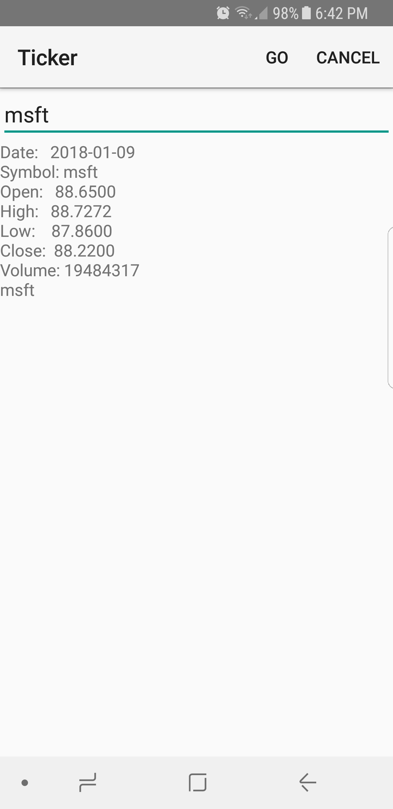

Ticker
===================================
This is an Android application used to look up the previous day's stock information by entering a stock ticker.

HttpsURLConnection and AsyncTask are used to perform the data fetch on a background thread using the AplhaVantage.co API.

Screenshots
-------------

 

References
-------------

Based on:
https://github.com/googlesamples/android-NetworkConnect

[1]: https://developer.android.com/reference/android/net/ConnectivityManager.html
[2]: https://developer.android.com/reference/android/net/NetworkInfo.html
[3]: https://developer.android.com/reference/android/os/AsyncTask.html
[4]: https://developer.android.com/reference/javax/net/ssl/HttpsURLConnection.html
[5]: https://developer.android.com/reference/android/app/IntentService.html
[6]: https://developer.android.com/reference/android/content/AsyncTaskLoader.html

